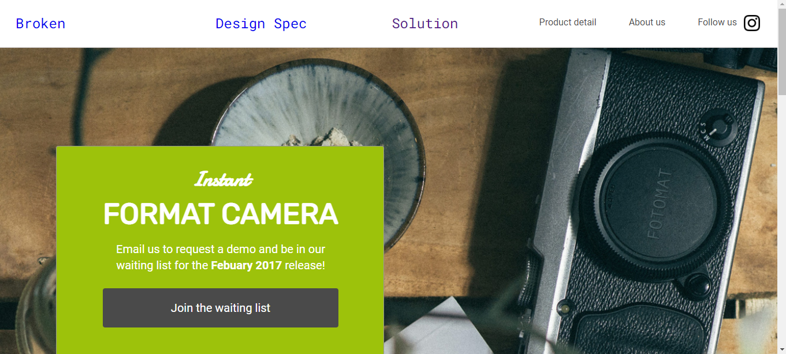
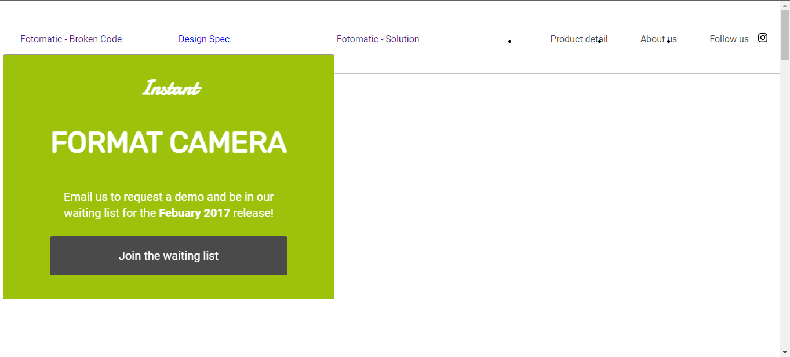

# Fotomatic
Fix a broken version of a responsive website called Fotomatic

## <a href="https://daryldelrosario.github.io/fotomatic/daryl-solution.html">Live Demo: Solution</a>

<kbd></kbd>

## <a href="https://daryldelrosario.github.io/fotomatic.html">Live Demo: Before Solution</a>   

<kbd></kbd>   

### Features
* Responsive to mobile media max-width 450px
* Responsive to tablet media between 450px and 760px
* CSS design uses combination of Flexbox and Grid
